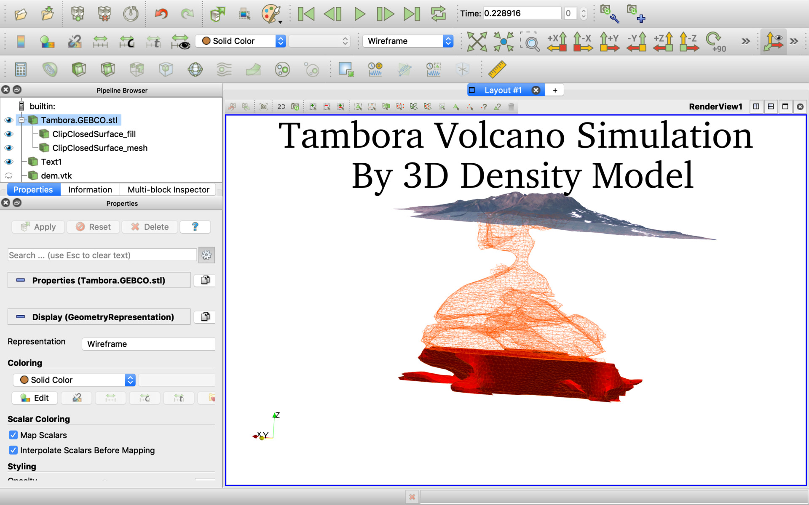
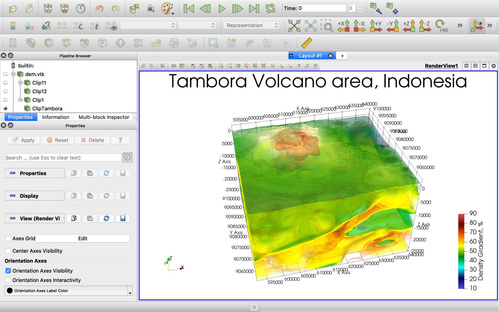

## ParaView Rijani Tambora

[ParaView](https://www.paraview.org/download/) project for Rijani and Tambora volcanoes area, Indonesia.

## Provided datasets ([EPSG:32750 WGS 84 / UTM zone 50S](https://epsg.io/32750))

  * grav_28.1.subset.*.vtk - our density and anomaly models by inversion of [Sandwell and Smith Gravity Anomaly and Vertical Gravity Gradient Open Datasets at 1 arc-minute resolution](https://www.linkedin.com/pulse/sandwell-smith-gravity-anomaly-vertical-gradient-open-pechnikov/) with bandpass filters 5-10k, 10-20km, 20-40km.

  * GEBCO_2019.subset.32750.0.5km_b_gamma2.5km,5.0km.anomaly.vtk - our density anomaly model by inversion of [GEBCO_2019 Bathymetry Grid is Open dataset at 15 arc-second resolution](https://www.linkedin.com/pulse/gebco2019-bathymetry-grid-open-datasets-15-arc-second-pechnikov/) with bandpass filter 2.5-5km. See our topography to gravity spectrum components transfer technique [Build Super-resolution Gravity from GGMplus Free-Air Gravity Anomaly (200m) enhanced by SRTM topography (30m)](https://www.linkedin.com/pulse/build-super-resolution-gravity-from-ggmplus-free-air-200m-pechnikov/)

  * AZI.\*, S* - [World Stress Map 2006](http://doi.org/10.5880/WSM.2016.001)

  * dem.vtk - [GEBCO_2019 Bathymetry Grid is Open dataset at 15 arc-second resolution](https://www.linkedin.com/pulse/gebco2019-bathymetry-grid-open-datasets-15-arc-second-pechnikov/)

  * Rinjani*.stl, Tambora*.stl - our 3D STL models of the volcanoes.

## How it looks

## How to open the project

Use [ParaView](https://www.paraview.org/download/) File -> Load State menu item to load the Tambora.pvsm or Tambora_simulation.pvsm project file and specify "data" subdirectory as "Data Directory".

## Authors

A.V.Durandin
https://orcid.org/0000-0001-6468-9757 (ORCID)
E-mail: durandin.andrew@gmail.com

A.O.Pechnikov
https://orcid.org/0000-0001-9626-8615 (ORCID)
E-mail: pechnikov@mobigroup.ru
